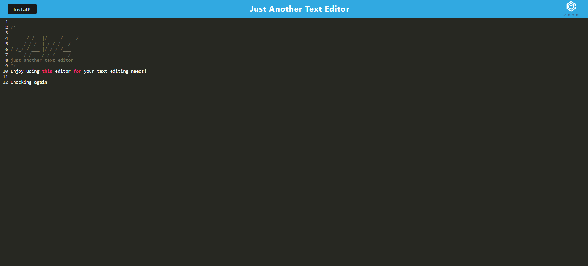

# progressive-text-editor

## Description
This application is a progressive web application where a user can input and edit text.  In addition, their inputs will be saved in a database that can be retrieved when the application is reloaded.  As it's a progressive web application, it can be installed by the user to their system and then be used both offline and online. This brings convenience and accessibility for the users and their text editing needs.

Working with webpack brought a new set of challenges.  Using multiple package.json files was difficult, and the first time I tried to get the application to work I was faced with an error message that was tough to figure out.  However with the help of BCS and my instructors we were able to figure it out and get the application working.  

It was great when the application was able to run both online and offline as well.

## Contributors
I wrote all of the code, but also received help from my instructor John, TA Michael, and utilized the help of several kind BCS tutors.

## Testing
To use this application, you can find it on Heroku at the link below.  If you are running it from your terminal, make sure to type ```npm i``` then ```npm run dev```.

To start with the application, simply open it and type in some text.  If you leave and revisit the app, what the user has written will still be in there and can be changed.  


[Link to Heroku app](https://clean-progressive-text-editor.herokuapp.com/)

Here is a screenshot of what the site should look like when running properly:



## License
Matt Carlson Code, 2022